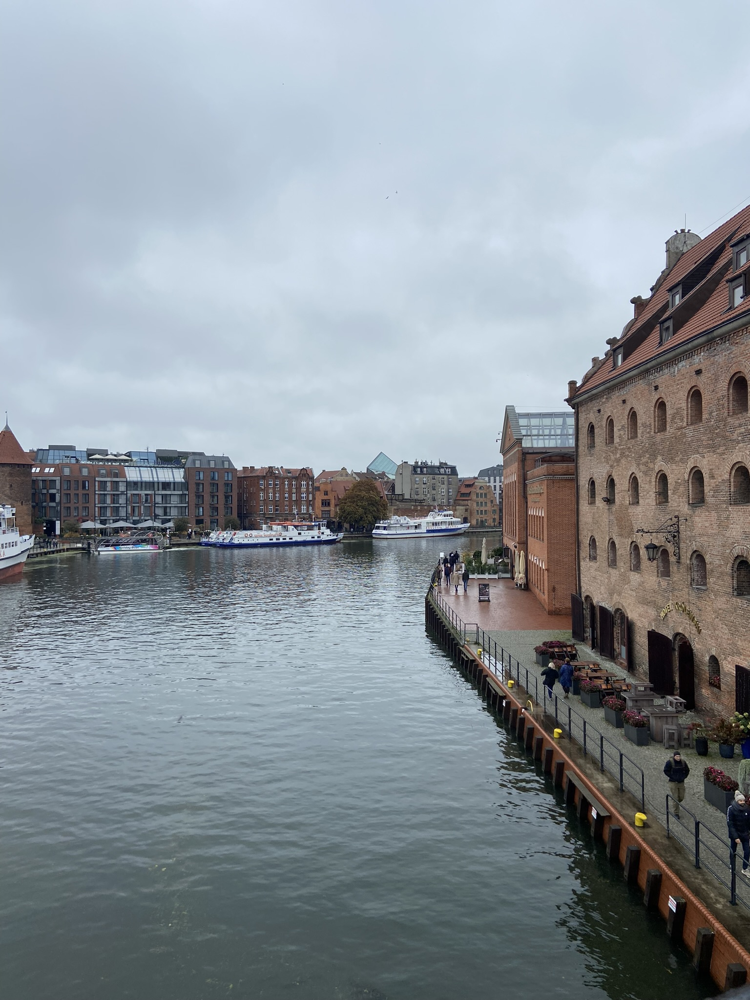

<header>
    
    <h1>Welcome to My Project</h1>
    <nav>
        <ul>
            <li><a href="#">Home</a></li>
            <li><a href="#">About</a></li>
        </ul>
    </nav>
</header>

<main>
    <section>
        <h2>About This Site</h2>
        
I am learning to code on a Mac using VS Code!

        
        
        <button onclick="sayHello()">Click for a Surprise</button>
    </section>

</main>

<footer>
    
© 2026 My Web Journey

</footer>
